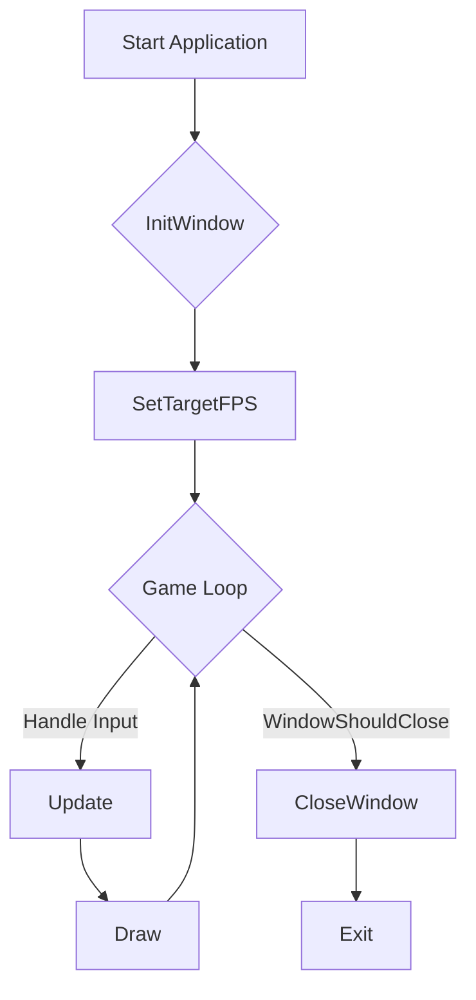
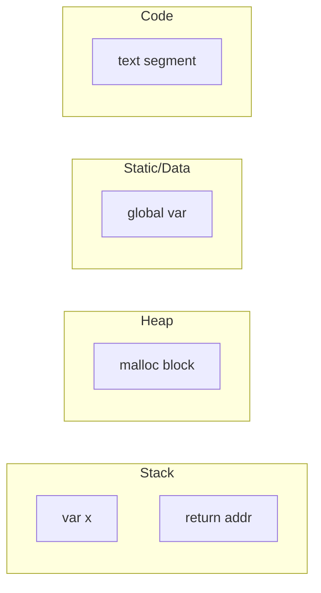
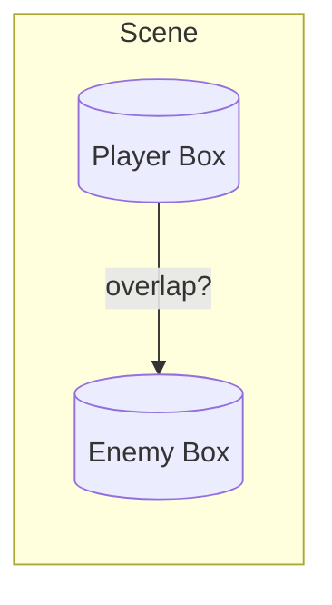

# Visual Aids

Below are Mermaid diagrams referenced by various lessons.  Feel free to embed or link them from markdown using the `create_diagram` tool or GitHub's native rendering.

---
## 1. Game Loop (used in Lesson 7 - Raylib Setup)

---
## 2. Memory Layout (used in Lesson 4 - Pointers & Memory)

---
## 3. Simple Collision (Axis-Aligned Bounding Box)

