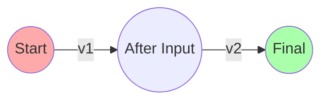

# Lesson 7a: Essential Math & Physics Utilities

Before we jump into player movement (Lesson 9) and collision (Lesson 13) we need a tiny tool-box of **reusable math helpers**.  Nothing heavy-duty—just the functions you'll use every time you update a position, clamp a stat, or interpolate a camera.

---
## Learning Objectives
By the end you will be able to
1. Represent 2-D vectors and perform common operations (`add`, `sub`, `scale`, `length`, `normalize`).
2. Use `clamp` to keep a value inside a valid range.
3. Smoothly transition between numbers with linear interpolation (`lerp`).
4. Update velocity/position each frame using *delta-time*.
5. Drop these helpers into any future project via a tiny header file.

> 📝 **Mini-Math Crash Course – read me first!**
> 1. **Screen coordinates**: In Raylib `(0,0)` is the **top-left** corner.  _X_ grows **right**, _Y_ grows **down**.  All positions are measured in **pixels**.
> 2. **Vector length (magnitude)**: `√(x² + y²)`.  Use `vec_len(v)` so you don't type that formula every time.
> 3. **Radians vs degrees**: C's `sin`/`cos` expect **radians**.  Convert like `rad = deg * PI / 180`.
> 4. **Normalising** (making a unit vector) keeps diagonal speed the same as straight-line speed → `vec_norm(v)`.
> 5. **Float precision**: 32-bit `float` can exactly represent every pixel up to ~16 million—plenty for 2-D games.
>
> Tip: the full header lives in **C-Quick-Reference.md** so you can copy-paste it into any project.

---
## 1  Why Not Just Write the Math Inline?
You can—but copy-pasting `x += vx * dt` all over the code base leads to mistakes and magic numbers.  A *central* header:
* Makes intent obvious (`Vector2f position = vec_add(position, velocity);`).
* Keeps formulas consistent.
* Lets you switch to floats or doubles later in **one file**.

---
## 2  A Minimal `math_utils.h`
```c
// math_utils.h  –  drop-in header, no implementation file needed
#ifndef MATH_UTILS_H
#define MATH_UTILS_H

#include <math.h>   // sqrtf, fabsf

// 2-D float vector (good for pixels & game-world units)
typedef struct { float x, y; } Vector2f;

static inline Vector2f vec2f(float x, float y) { return (Vector2f){x, y}; }
static inline Vector2f vec_add(Vector2f a, Vector2f b) { return vec2f(a.x + b.x, a.y + b.y); }
static inline Vector2f vec_sub(Vector2f a, Vector2f b) { return vec2f(a.x - b.x, a.y - b.y); }
static inline Vector2f vec_scale(Vector2f v, float s) { return vec2f(v.x * s, v.y * s); }
static inline float    vec_dot(Vector2f a, Vector2f b) { return a.x*b.x + a.y*b.y; }
static inline float    vec_len(Vector2f v)             { return sqrtf(vec_dot(v,v)); }
static inline Vector2f vec_norm(Vector2f v)            {
    float len = vec_len(v);
    return (len > 0.0f) ? vec_scale(v, 1.0f/len) : vec2f(0,0);
}

static inline float clampf(float v, float min, float max) {
    if (v < min) return min;
    if (v > max) return max;
    return v;
}

static inline float lerpf(float a, float b, float t) {    // t in [0,1]
    return a + (b - a) * t;
}

#endif // MATH_UTILS_H
```

> **Header-only?** The `static inline` trick tells the compiler to embed the code in any file that includes the header—no `math_utils.c` required.

### Plain-English Tour of the Helpers
*(Skip the code and read this first – then the code will make sense.)*

| Helper | "Human" description | Everyday analogy |
|--------|---------------------|------------------|
| `Vector2f` | A pair of numbers `(x, y)` that stores a **position** or a **direction** in 2-D. | The coordinates on a treasure map: 3 steps east, 2 steps south. |
| `vec_add(a,b)` | Move by `b` starting from `a`. | Walk 5 m north, **then** 2 m east. |
| `vec_scale(v, s)` | Make the vector longer/shorter by factor `s`. | Double a recipe: every ingredient × 2. |
| `vec_len(v)` | How long the arrow is – its speed if it were a velocity. | Length of a ruler laid on the map. |
| `vec_norm(v)` | Same direction, but length = 1.  Keeps speed consistent diagonally. | Saying "go north-east" **without** specifying distance. |
| `clampf(v,min,max)` | Force a number to stay between two limits. | Cruise-control that won't let the car exceed 100 km/h or drop below 20 km/h. |
| `lerpf(a,b,t)` | Slide smoothly from **a** to **b**.  `t=0` → a, `t=1` → b, `t=0.5` → halfway. | A dimmer switch fading from dark to bright. |

### Why `delta-time` ( `dt` )?
Games run a loop **many times per second**.  If your PC is fast you might get 120 loops per second; on a laptop maybe 30.  If we move the player **5 pixels every loop** the game runs *four times faster* on the desktop!

Solution → multiply all movement by **how much *time* passed since the previous loop**.  That tiny slice of time is `dt`.

```
position += speed * dt;   // same real-world metres per second everywhere
```

Raylib gives you `GetFrameTime()` which already returns `dt` in **seconds**.  So with a speed of `50` the object travels `50 pixels per second`, independent of frame-rate.

---
## 3  Delta-Time Physics Update
The game loop will run at ~60 FPS, but on slower computers it may dip.  Frame-rate independent motion = multiply by the *time passed since last frame*.

```c
#include "math_utils.h"
#include <raylib.h>

int main(void) {
    InitWindow(800, 600, "Delta-time demo");
    Vector2f pos = vec2f(400, 300);
    Vector2f vel = vec2f(50, 0);   // 50 pixels per second to the right

    while (!WindowShouldClose()) {
        float dt = GetFrameTime();  // Seconds since previous frame
        if (IsKeyDown(KEY_UP))   vel.y -= 200 * dt;
        if (IsKeyDown(KEY_DOWN)) vel.y += 200 * dt;

        pos = vec_add(pos, vec_scale(vel, dt));

        // Keep inside window
        pos.x = clampf(pos.x, 0, GetScreenWidth());
        pos.y = clampf(pos.y, 0, GetScreenHeight());

        BeginDrawing();
            ClearBackground(BLACK);
            DrawCircleV((Vector2){pos.x, pos.y}, 10, RAYWHITE);
        EndDrawing();
    }
    CloseWindow();
    return 0;
}
```

---
## 4  Visual Aid – Vector Addition
Below is a quick diagram showing how two movement vectors combine:


* `v1` might be keyboard input, `v2` could be wind or conveyor belts.  `vec_add` gives the final displacement for the frame.*

---
## 5  Exercises
1. **Orbit** – Create two vectors `pos` and `center`.  Each frame rotate `pos` around `center` using `sin`/`cos` and your vector helpers.
2. **Lerp Camera** – Write a function `Vector2f cam_follow(Vector2f cam, Vector2f target, float speed, float dt)` that moves the camera towards the target using `lerpf`.
3. **Bounce Clamp** – Modify `clampf` to *invert* velocity when the value hits the boundary (simple elastic collision).

---
## Commit Your Progress
```bash
git add lessons/07a-math-utilities.md
git commit -m "Add Lesson 7a: Essential math & physics utilities"
```

Next stop: `09-player-movement.md` where you'll put these helpers to work!  Feel free to include `math_utils.h` in your own code base right away. 